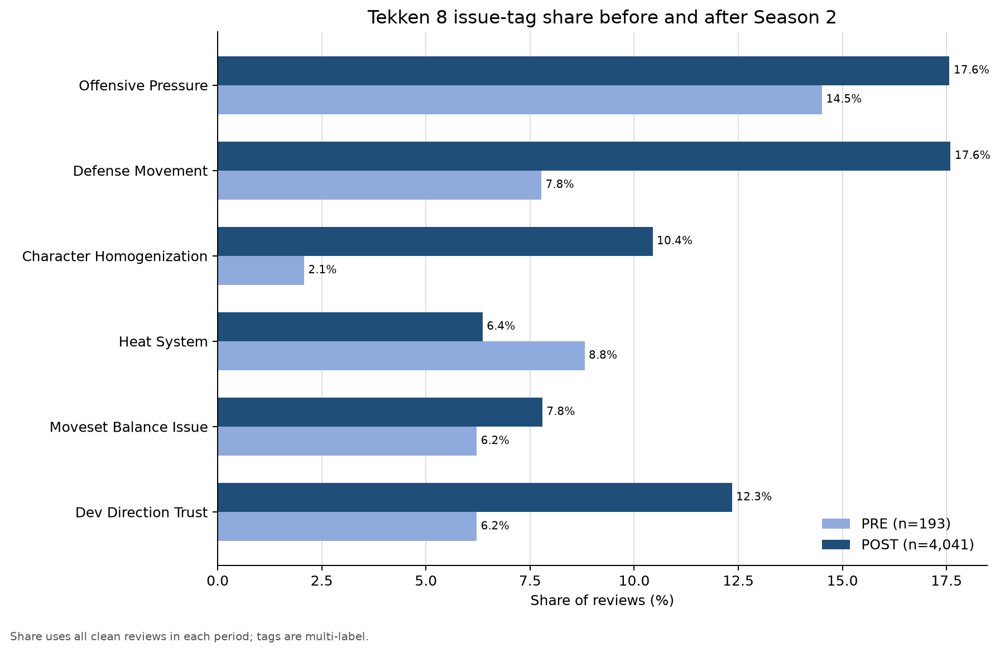
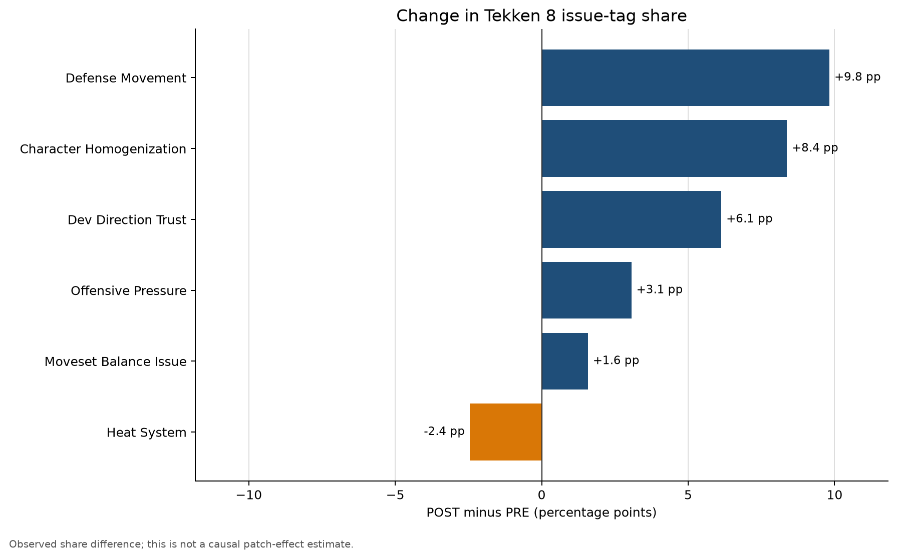

# Tekken 8 Season 2 Review Analysis

*Steam review analysis using TF-IDF, manual keyword validation, and multi-label issue tagging.*

## 1. Project Overview

This project examines how gameplay topics in English Steam reviews changed around Tekken 8 Season 2 / v2.00.01. It combines keyword exploration, human context validation, and rule-based multi-label tagging rather than treating raw keyword counts as issues automatically.

The repository is a portfolio extract of a larger review-analysis project. Raw Steam reviews and API collection files are intentionally excluded.

## 2. Key Question

> Which gameplay issues became more prominent in reviews collected after Tekken 8 Season 2 / v2.00.01, and how did the patterns differ between Recommended and Not Recommended reviews?

The results describe observed associations after the update. They do not establish that the patch caused the changes.

## 3. Dataset

| Period | Reviews | Recommended rate |
|---|---:|---:|
| PRE | 193 | 61.1% |
| POST | 4,041 | 6.8% |
| **Total** | **4,234** | — |

- PRE: 14 days immediately before the update cutoff.
- POST: 14 days immediately after the cutoff.
- One or more issue tags were assigned to 1,403 reviews (33.14%).
- Any-tag coverage: PRE 21.76%, POST 33.68%, Recommended 11.48%, Not Recommended 35.35%.

## 4. Analysis Pipeline

> Steam Reviews → PRE / POST Window → Frequency / TF-IDF → Keyword Candidate Classification → Manual Validation → Issue Tag Dictionary v0.2 → Multi-label Issue Tagging → PRE / POST Comparison → Recommended / Not Recommended Comparison

## 5. Manual Keyword Validation

Validation checked whether each keyword was used in the intended topic sense. `TP` and `FP` therefore describe contextual relevance, not positive or negative sentiment.

- Core validation: 9 keywords × 5 reviews = 45 manually reviewed contexts.
- Defense supplemental validation: 5 separately reviewed contexts, all TP.
- The core 45-review set and the 5-review defense supplement remain distinct validation sets.

Keywords were classified as:

- Issue: `heat`, `defense`
- Conditional: `devs`, `character`, `characters`, `moves`
- Context: `changes`, `patch`, `season`, `fighting`

Context terms cannot trigger a tag alone. Conditional terms require a validated phrase or issue cue.

## 6. Issue Tag Dictionary

The final dictionary contains six multi-label topics:

1. `Offensive_Pressure`
2. `Defense_Movement`
3. `Character_Homogenization`
4. `Heat_System`
5. `Moveset_Balance_Issue`
6. `Dev_Direction_Trust`

Matching uses lowercase normalization, regex word boundaries, multi-word phrase priority, conditional rules, and exclusions for neutral or unrelated contexts. A review may receive multiple tags.

## 7. Key Findings

### Insight 1 — Recommended rate fell sharply in the post-update review sample

The Recommended rate was 61.1% in PRE reviews and 6.8% in POST reviews. This is an observed change in the collected review sample, not a causal estimate of the patch's effect.

### Insight 2 — The aggregate increase in defense mentions was partly compositional

`Defense_Movement` increased from 7.77% PRE to 17.59% POST (+9.82 percentage points). Within Not Recommended reviews, however, it was nearly unchanged: 18.67% PRE versus 18.50% POST.

This indicates that the aggregate increase was also influenced by the much larger proportion of Not Recommended reviews in POST.

### Insight 3 — Character homogenization rose within the same recommendation group

`Character_Homogenization` increased from 2.67% to 10.88% within Not Recommended reviews. Unlike defense, it became more prominent even after holding the recommendation group constant, making it a relatively newly emphasized post-update issue.

Largest aggregate PRE → POST changes:

| Issue tag | PRE | POST | Change |
|---|---:|---:|---:|
| Defense_Movement | 7.77% | 17.59% | +9.82 pp |
| Character_Homogenization | 2.07% | 10.44% | +8.37 pp |
| Dev_Direction_Trust | 6.22% | 12.35% | +6.13 pp |

## 8. Visual Results





## 9. Repository Structure

```text
.
├── README.md
├── requirements.txt
├── notebooks/
│   └── 01_tekken8_season2_review_analysis.ipynb
├── src/
│   └── issue_tagging.py
├── data/processed/
│   ├── tekken8_final_summary.csv
│   ├── tekken8_issue_pre_post.csv
│   ├── tekken8_issue_by_recommendation.csv
│   ├── keyword_validation_summary.csv
│   ├── tekken8_issue_tag_dictionary_v02.csv
│   ├── tagging_summary.csv
│   ├── tagging_qa_examples.csv
│   └── analysis_quality_checks.csv
├── figures/
│   ├── tekken8_issue_share_pre_post.png
│   └── tekken8_issue_percentage_point_change.png
└── docs/
    ├── analysis_summary.md
    └── dictionary_design_notes.md
```

## 10. Methodology

- Reviews were assigned to fixed PRE and POST UTC windows.
- Frequency and TF-IDF were used for candidate exploration, not automatic issue confirmation.
- Human validation checked real review context before dictionary construction.
- Tagging used phrase-first rules, word boundaries, conditional cues, and exclusions.
- Shares use all clean reviews in each comparison group as the denominator.
- Recommended reviews containing a tag were not automatically interpreted as complaints.

The executed notebook presents the published aggregate results. `src/issue_tagging.py` contains the review-level tagging rules and can be applied to a user-supplied clean review CSV with the documented columns.

## 11. Limitations

- PRE and POST sample sizes are highly imbalanced.
- Steam reviews are self-selected and do not represent all players.
- Keyword and regex rules cannot fully resolve sarcasm, negation, or every local context.
- Manual validation used five reviews per keyword.
- Multi-label shares overlap and should not be summed.
- Observational review data cannot establish the patch's causal effect.

## 12. How to Run

Create an environment and install the minimal dependencies:

```bash
python -m venv .venv
# Windows
.venv\Scripts\activate
pip install -r requirements.txt
```

Run the portfolio notebook from the repository root:

```bash
python -m jupyter nbconvert --execute --to notebook --inplace notebooks/01_tekken8_season2_review_analysis.ipynb
```

The repository does not include raw Steam reviews. To apply the published tagging rules to another clean export:

```bash
python src/issue_tagging.py path/to/clean_reviews.csv path/to/tagged_reviews.csv
```

The input must contain `recommendationid`, `period`, `recommendation_group`, and `review_text`.
